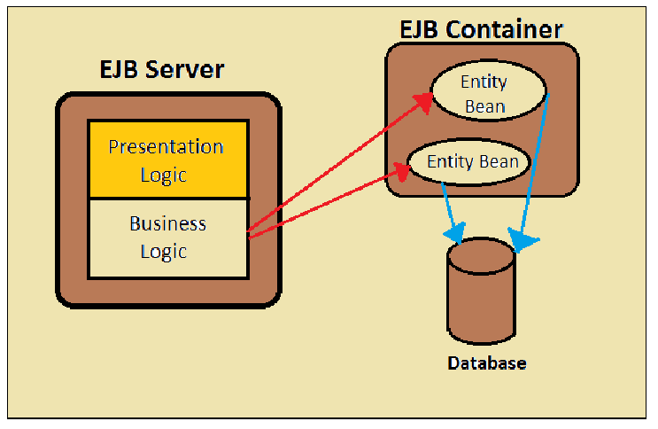

# 基于EJB的JavaWeb超市订单管理系统

参考自狂神的JavaWeb项目，引入EJB技术，作为组件技术课程结课大作业的案例。

## 软件及开发工具
| 软件及开发工具 | 版本 |
|:---:|:---:|
| Java | 1.8 |
| Wildfly/JBoss | 23.0.0.Final |
| MySQL | 8.0.16 |
| Maven | 3.5.3 |
| IntelliJ IDEA | 2021.1.1 |
